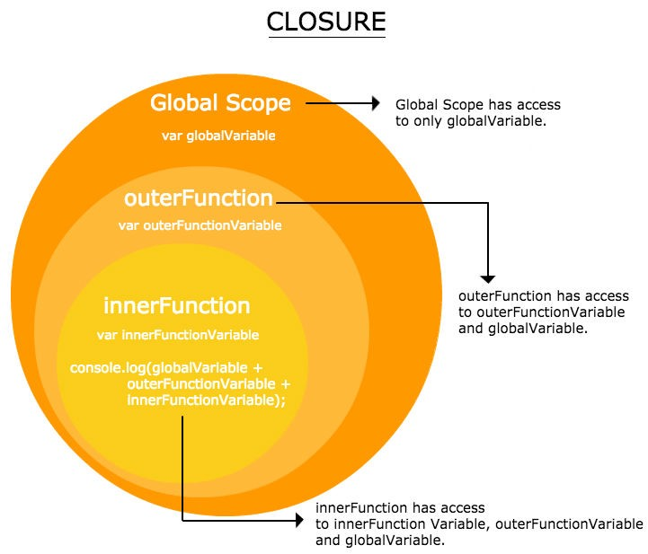

# Closure
함수를 리턴할 때, 그 함수가 속해있던 context (변수 정보 등을 담고 있음)도 같이 따라옴.
counter 변수 같은거 필요할 때, 전역변수 사용할 필요 없이 closure 활용하면 private 변수처럼 카운트 저장하는 변수 관리 가능

이거 읽고 예제 코드 몇 번 짜보면 대충 이해됨
https://poiemaweb.com/js-closure

MDN doc
https://developer.mozilla.org/ko/docs/Web/JavaScript/Closures

<br>

### 렉시컬 환경을 공유하는 클로저
[왜 필요한데?](https://poiemaweb.com/js-closure#:~:text=%EA%B0%80%EB%8A%A5%ED%95%9C%20%EC%B9%B4%EC%9A%B4%ED%84%B0%EB%A5%BC%20%EB%A7%8C%EB%93%A4%EB%A0%A4%EB%A9%B4-,%EB%A0%89%EC%8B%9C%EC%BB%AC%20%ED%99%98%EA%B2%BD%EC%9D%84%20%EA%B3%B5%EC%9C%A0%ED%95%98%EB%8A%94%20%ED%81%B4%EB%A1%9C%EC%A0%80%EB%A5%BC,-%EB%A7%8C%EB%93%A4%EC%96%B4%EC%95%BC%20%ED%95%9C%EB%8B%A4.)

[예제1](https://velog.io/@kym123123/%ED%81%B4%EB%A1%9C%EC%A0%80closure#:~:text=%EC%83%81%ED%83%9C%20%EB%B3%80%EC%88%98%EB%A5%BC%20%EA%B3%B5%EC%9C%A0%ED%95%98%EB%8A%94%20%ED%81%B4%EB%A1%9C%EC%A0%80%EB%A5%BC%20%EB%A7%8C%EB%93%9C%EB%8A%94%20%EB%B0%A9%EB%B2%95) - Obj of functions 리턴해도 클로저 적용 된다

<br>

### Scope에 대해서

우리가 익숙한 C, Python 등 언어는 Block-level scope
JS는 function-level scope

그래서 익숙하지 않은 일 종종 일어남

* ES6 'let' 사용하면 블록 레벨 스코프 사용 가능
```JS
var x = 0;
{
  var x = 1;
  console.log(x); // 1
}
console.log(x);   // 1

let y = 0;
{
  let y = 1;
  console.log(y); // 1
}
console.log(y);   // 0
```


[poiemaweb - closure에서의 lexical scope](https://poiemaweb.com/js-closure#:~:text=%EC%8A%A4%EC%BD%94%ED%94%84%EB%8A%94%20%ED%95%A8%EC%88%98%EB%A5%BC%20%ED%98%B8%EC%B6%9C%ED%95%A0%20%EB%95%8C%EA%B0%80%20%EC%95%84%EB%8B%88%EB%9D%BC%20%ED%95%A8%EC%88%98%EB%A5%BC%20%EC%96%B4%EB%94%94%EC%97%90%20%EC%84%A0%EC%96%B8%ED%95%98%EC%98%80%EB%8A%94%EC%A7%80%EC%97%90%20%EB%94%B0%EB%9D%BC%20%EA%B2%B0%EC%A0%95%EB%90%9C%EB%8B%A4 "Closure _ PoiemaWeb.mhtml")
[poiemaweb2 - lexical scope](https://poiemaweb.com/js-scope#:~:text=%23-,7.%20%EB%A0%89%EC%8B%9C%EC%BB%AC%20%EC%8A%A4%EC%BD%94%ED%94%84,-%EC%95%84%EB%9E%98%20%EC%98%88%EC%A0%9C%EC%9D%98%20%EC%8B%A4%ED%96%89 "Scope _ PoiemaWeb.mhtml")

<br>





Master the JavaScript Interview: What is a Closure? (읽어볼만 할까? 모르겠다)
https://medium.com/javascript-scene/master-the-javascript-interview-what-is-a-closure-b2f0d2152b36

