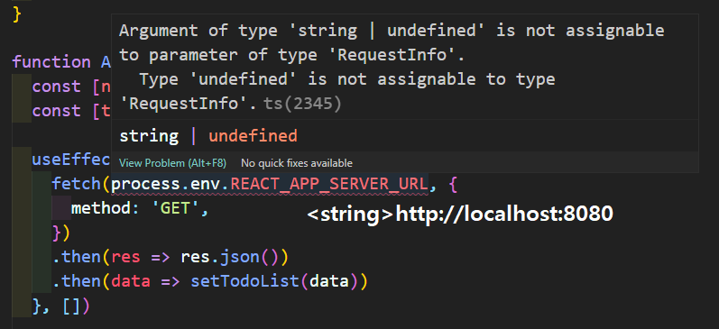

환경 변수 값의 type이 string || null인데, fetch에 null값을 넣어주면 안돼서 그럼

해결책
https://stackoverflow.com/questions/54496398/typescript-type-string-undefined-is-not-assignable-to-type-string

```js
// 1. 미리 null check
useEffect(() => {
	if(!process.env.REACT_APP_SERVER_URL)
		throw new Error("Wrong URL")

	fetch(process.env.REACT_APP_SERVER_URL!, {
	  method: 'GET',
	})
	.then(res => res.json())
	.then(data => setTodoList(data))
}, [])


// 2. null이 아닐거라고 믿고 null typing 무시 -> null일 경우 runtime error
// 2-1. non-null assertion operator
useEffect(() => {
	fetch(process.env.REACT_APP_SERVER_URL!, {
	  method: 'GET',
	})
	.then(res => res.json())
	.then(data => setTodoList(data))
}, [])

// 2-2. casting
useEffect(() => {
	fetch(process.env.REACT_APP_SERVER_URL as string, {
	  method: 'GET',
	})
	.then(res => res.json())
	.then(data => setTodoList(data))
}, [])


// 3. optional chaning(?.) 사용?
```

