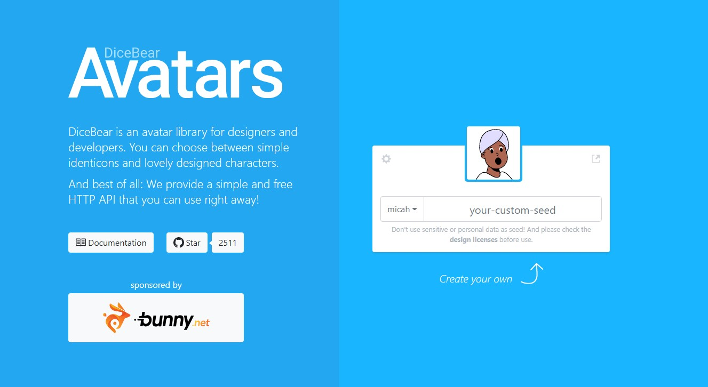
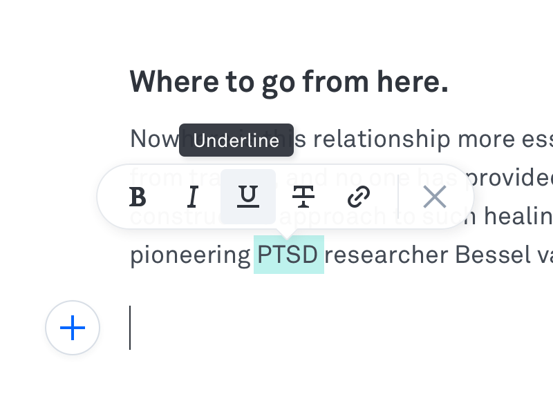
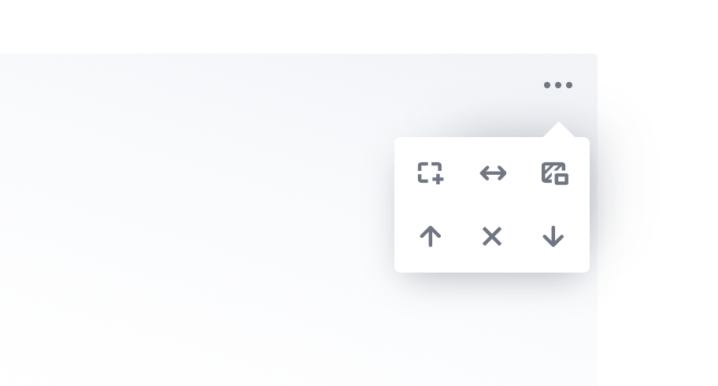
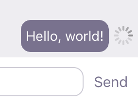
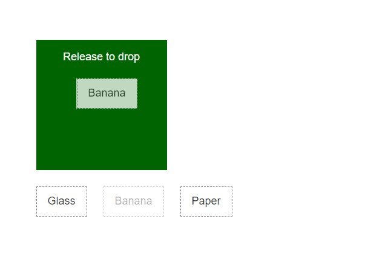

- React Icons

https://github.com/react-icons/react-icons#configuration
https://reactnativeelements.com/docs/icon/#reverse
[Styling](https://stackoverflow.com/questions/56636280/how-to-style-react-icons)

 

* TOAST UI
  JavaScript UI library and free open source project constantly managed by NHN
  차트, WYSIWYG 에디터, 캘린더 같은 기능성 application 제공 - React에서도 쓸 수 있는 듯? 
  [https://ui.toast.com/](https://ui.toast.com/)

  ⭐️ 진국은 페이지 상단의 FE GUIDE 나 WEEKLY PICKS 메뉴; FE관련 흥미로운 내용들 많다.

 

* (디자인 프레임웤) material UI
  bootstrap 같은 컴포넌트, 디자인 라이브러리
  https://material-ui.com/getting-started/usage/
  
  
  
  가장 유명한건 antd, bootstrap (컴포넌트가 필요하면 react-bootstrap) 인데, 설명이 좀 불친절 한 듯?
  Chakra-UI나 material UI가 그나마 친절 (개인 플젝할때 빠르게 써먹기 편함)
  
  
  
  Chakra UI
  
  open drawer 예시 (와!)
  
  https://chakra-ui.com/docs/hooks/use-disclosure
  
  Modal도 엄청 쉽게 구현
  
  https://chakra-ui.com/docs/overlay/modal#make-modal-vertically-centered

 

* ⭐️ ReactJS Design examples

  여러 UI, 디자인들 예시 있음! 생각은 나지만 이름이 떠오르지 않는 디자인 같은거, 아니면 새로운 디자인 찾을 때 유용
  https://reactjsexample.com/tag/sidebar/

---

Name of the commonly used component styles gathered

- Modal window
  
  react-modal
  직접 만들기? [링크](https://medium.com/@bestseob93/%ED%9A%A8%EC%9C%A8%EC%A0%81%EC%9D%B8-%EB%A6%AC%EC%95%A1%ED%8A%B8-%EB%AA%A8%EB%8B%AC-react-modal-%EB%A7%8C%EB%93%A4%EA%B8%B0-bd003458e9d)
  (디자인 프레임워크에 포함된 컴포넌트 쓰면 바로 사용 가능. 직접 구현 안해도 됨)

 

- Segmented control (or button group)
  
  https://www.reddit.com/r/reactnative/comments/p4wkyk/what_is_the_component_on_the_right_called/

 

- Tool-tip
  
  npm install react-tooltip
  https://www.newline.co/@dmitryrogozhny/4-ways-to-show-tooltips-in-react-with-react-tooltip,-material-ui,-bootstrap,-or-semantic-ui--e3473190

  * 이 정도는 간단하게 직접 만들수도? [링크](https://velog.io/@altmshfkgudtjr/Custom-Tooltip-%EC%A0%9C%EC%9E%91%EA%B8%B0)
  
  * 버튼 위에 마우스 올리면 툴팁 나타나게 - [링크](https://codepen.io/hy2850/pen/zYdNYVx)
  
    마찬가지로 디자인 프레임워크에 기본적으로 다 있음
  
   
  
- Toast notification

정의) [https://ux.stackexchange.com/questions/11998/what-is-a-toast-notification](https://ux.stackexchange.com/questions/11998/what-is-a-toast-notification))

  [모듈 - toastr 라이브러리](https://nowonbun.tistory.com/565)
 [toastr 라이브러리 활용2](https://www.leafcats.com/113)

  [raw js로 구현](https://marshall-ku.tistory.com/307)
[notifications.js](https://www.cssscript.com/minimal-notification-popup-pure-javascript/#comments)

 

* Avatar
시드 넣어주면 랜덤 아바타 만들어주는 - 간단한 프로젝트에 적격

[여기서](https://www.youtube.com/watch?v=J5x3OMXjgMc&ab_channel=Fireship) 6분대에서 사용함.

 

* inline-toolbar - editor.js

https://editorjs.io/enable-inline-toolbar

 

* block settings - editor.js

https://editorjs.io/making-a-block-settings

 

* Optimistic UI - 메시지가 잘 전달되었는지 유저에게 보여주는 UI/UX

  

  https://uxplanet.org/optimistic-1000-34d9eefe4c05

 

* Drag and drop

  

https://stackoverflow.com/questions/20926551/recommended-way-of-making-react-component-div-draggable
https://github.com/react-dnd/react-dnd

