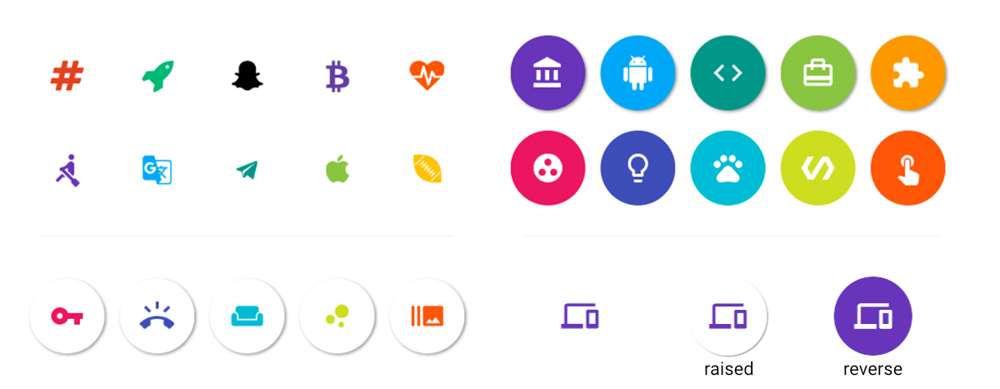
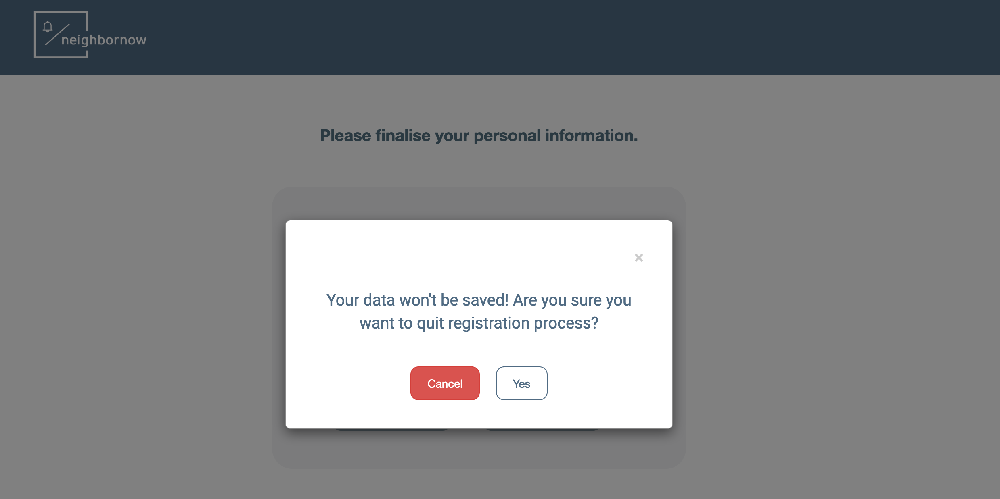
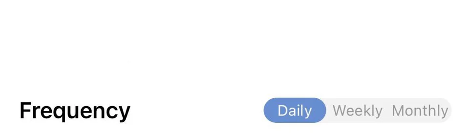
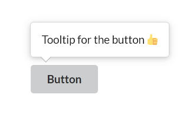
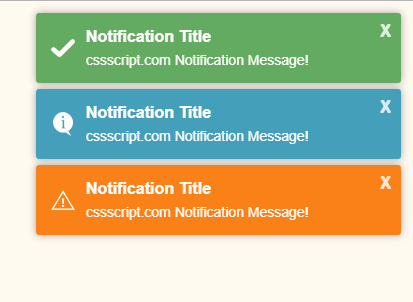

- React Icons

https://github.com/react-icons/react-icons#configuration
https://reactnativeelements.com/docs/icon/#reverse
[Styling](https://stackoverflow.com/questions/56636280/how-to-style-react-icons)

 

* TOAST UI
JavaScript UI library and free open source project constantly managed by NHN
(깔끔하고 이쁜 컴포넌트 많음)
[https://ui.toast.com/](https://ui.toast.com/)

 

* material UI
bootstrap 같은 컴포넌트, 디자인 라이브러리
https://material-ui.com/getting-started/usage/

---

Name of the commonly used component styles gathered

- Modal window
  
  react-modal
  직접 만들기? [링크](https://medium.com/@bestseob93/%ED%9A%A8%EC%9C%A8%EC%A0%81%EC%9D%B8-%EB%A6%AC%EC%95%A1%ED%8A%B8-%EB%AA%A8%EB%8B%AC-react-modal-%EB%A7%8C%EB%93%A4%EA%B8%B0-bd003458e9d)

 

- Segmented control (or button group)
  
  https://www.reddit.com/r/reactnative/comments/p4wkyk/what_is_the_component_on_the_right_called/

 

- Tool-tip

npm install react-tooltip
https://www.newline.co/@dmitryrogozhny/4-ways-to-show-tooltips-in-react-with-react-tooltip,-material-ui,-bootstrap,-or-semantic-ui--e3473190

  이 정도는 간단하게 직접 만들수도? [링크](https://velog.io/@altmshfkgudtjr/Custom-Tooltip-%EC%A0%9C%EC%9E%91%EA%B8%B0)
  
   
  
- Toast notification

정의) [https://ux.stackexchange.com/questions/11998/what-is-a-toast-notification](https://ux.stackexchange.com/questions/11998/what-is-a-toast-notification))

  [모듈 - toastr 라이브러리](https://nowonbun.tistory.com/565)
 [toastr 라이브러리 활용2](https://www.leafcats.com/113)
 
  [raw js로 구현](https://marshall-ku.tistory.com/307)
[notifications.js](https://www.cssscript.com/minimal-notification-popup-pure-javascript/#comments)