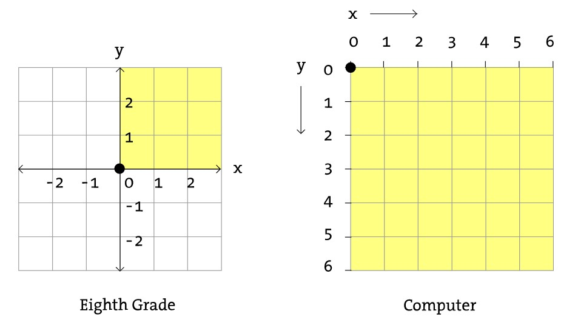

p5.js : Java 기반의 그래픽 라이브러리인 Processing을 JS로 포팅한 것

 

```js
function setup() {
	cnv = createCanvas(w, h);
    
}

function draw() {
	background(color);
}

```


loop() noloop() [예제 재밌음](https://p5js.org/reference/#/p5/noLoop)


좌표 헷갈리지 말기




p5.Element

HTML tag 같은 DOM과 canvas에 그려지는 도형 요소들로 나뉨.

removeElements - 모든 DOM 요소 삭제

remove() - 캔버스에 그려진 도형 요소만 삭제 


🔥 매우 거지같은게, 한번 도형 그리면 다음 draw 호출까지는 못지움. fill이나 stroke같이 외형 바꾼 것도 마찬가지

```
stroke('black');
fill(0, 0, 0, 0);
rect(X, Y, W, H);
```

방법 1. draw, redraw

방법 2. draw 호출안하고, 화면 그려주는 함수만 (만약 있다면) 호출해서 화면 overwrite한다

방법 3. erase활용 - 잘 안됨; 겹친 요소들을 다 삭제해버리기 때문


---

배경

createCanvas - 캔바스 그려야 도형 그려짐.

🔥 repositioning canvas : https://github.com/processing/p5.js/wiki/Positioning-your-canvas

width, height


위치

p5Elem.position 

mouseX mouseY 마우스 좌표


도형

ellipse(x, y, width, height)

line

rect


fill, noFill (도형 색 채우기)

stroke, noStroke (도형/라인 테두리)

색깔 - 'black', 'red', 'blue'

fill, stroke 호출 이후 나타나는 모든 도형에 적용. 취소하려면 noFill, noStroke 호출해야.

✨색 관련 매우 좋은 튜토리얼 https://p5js.org/learn/color.html


Transformation

translate : origin 옮기기

rotate : origin 기준으로 회전

https://www.youtube.com/watch?v=o9sgjuh-CBM&ab_channel=TheCodingTrain#t=13m00s

회전 신기한 예시) https://p5js.org/reference/#/p5/angleMode


회전이 골때리는게, 

1. Origin point 기준으로 회전 
   (만약 도형 자체를 회전시키고자 한다면, translate로 origin을 도형 위치로 옮겨줘야)
2. rotate 호출 후 나타나는 **모든** 도형들을 회전

즉,  한 도형만 회전시키고자 한다면, translate와 rotate 이후 다시 되돌려야 함. 

```JS
translate(X, Y);
rotate(-PI / 6);

//ellipse(X, Y, W, H); // origin is now (X, Y)
ellipse(0, 0, W, H);

// 되돌리기
rotate(PI / 6);
translate(-X, -Y);
```


이미지

매 draw마다 다시 그려줘야 하고, load때마다 시간 너무 오래 걸리는 듯 (overhead)

```js
loadImage('./trebleClef.png', img => {
    img.resize(110, 225);
    image(img, -10, sheetY);
});
```


HTML 태그

createP : <p></p> 생성

createDiv

p5Elem.html() : inner HTML (내용) 변경 혹은 append


Event listener

mousePressed


---

p5.js 전용으로 overwrite된 JS 함수들


* map : Re-maps a number from one range to another.

```javascript
map(value, start1, stop1, start2, stop2, [withinBounds])
```

normalize할때 유용

```js
let fitness = map(this.population[i].fitness, 0, maxFitness, 0, 1); // fitness를 0~1 사이의 값으로 normalize
```


* random : 0~1 사이의 값

```javascript
random([min], [max])
random(choices) // array to choose from
```


* floor, ceil


---

기타 도움되는 ref

* 도형 그려주는 helper 함수 내가 직접 만들기

  https://p5js.org/ko/examples/structure-functions.html

* customized 도형 클래스 직접 만들기

  https://p5js.org/ko/examples/structure-functions.html

  https://p5js.org/examples/objects-objects-2.html

  


---

p5js sound

* p5.Delay

  사운드에 에코 넣어줌
  https://p5js.org/reference/#/p5.Delay

  
